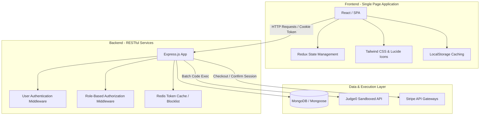
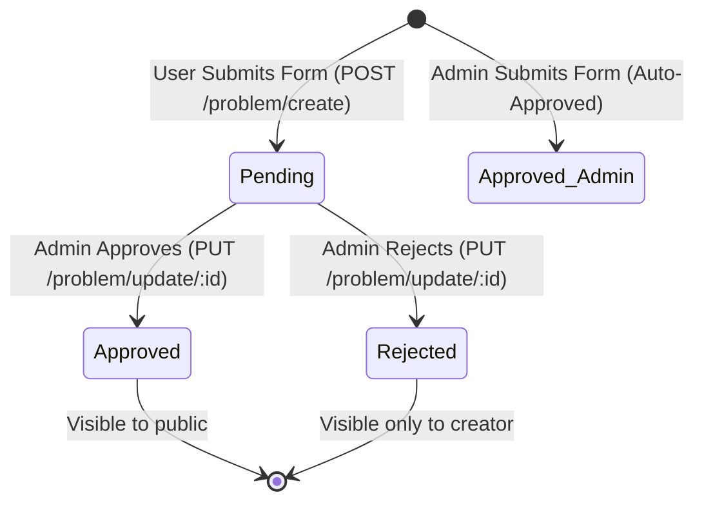

# 🎓 ALGORISE - Interview Preparation & Project Deep-Dive Guide

This guide is designed to help you explain **ALGORISE** in software engineering interviews. It details the architecture, technical decisions, complex challenges, database design, and key behavioral stories (STAR method) so you can confidently pitch this project as a full-stack engineering highlight.

---

## 🎙️ 1. The 30-Second Elevator Pitch

> *"ALGORISE is a high-performance, full-stack competitive programming and interview preparation platform built on the MERN stack. It features a sandboxed online code execution engine integrated with Judge0, allowing users to solve and submit problems in multiple languages. To support scalability, the platform includes a community problem-submission pipeline with admin moderation, real-time leaderboards, streak-based gamification, and an interview preparation module with Stripe-integrated premium company packs. I designed this to mimic real-world system flows, solving complex state persistence challenges like Stripe webhook/session verification and database-backed purchase validation."*

---

## 🏗️ 2. High-Level Architecture & Tech Stack



### Technical Stack Decisions

*   **Frontend**: React (for components reuse), Redux (for global auth state), Tailwind CSS (for custom glassmorphic aesthetics), React Router (declarative client-side routing).
*   **Backend**: Node.js & Express.js (non-blocking I/O, perfect for API routing and asynchronous network calls to code sandboxes).
*   **Database**: MongoDB & Mongoose (flexible schema design for problems, submissions, and purchases; indexes optimized for query performance).
*   **Sandboxing**: Judge0 REST API (provides secure sandboxing, runtime limitations, memory constraints, and stdout/stderr assertion).
*   **Payments**: Stripe (Stripe Checkout sessions with metadata and manual backend session verification).

---

## ⚡ 3. Key Technical Implementations & Design Patterns

### A. The Sandboxed Execution Pipeline (Judge0)
To prevent malicious code execution (RCE) on our primary servers, code execution is completely isolated.
1. **Batch Submissions**: To optimize network roundtrips, we pack all test cases (visible for run code, hidden for submit code) into a single batch request to Judge0 (`submitBatch`).
2. **Polling / Token Verification**: Judge0 processes submissions asynchronously and returns unique tokens. The backend polls or awaits token completion (`submitToken`).
3. **Execution Status Mapping**:
    *   `status_id: 3` $\rightarrow$ **Accepted** (accumulates runtime/memory metrics).
    *   `status_id: 4` $\rightarrow$ **Compilation Error** (extracts `compile_output` / `stderr`).
    *   `status_id > 4` $\rightarrow$ **Runtime/Wrong Answer** (captures error logs without exposing raw server internals).

### B. Community Problem Moderation (State Machine)
To scale the platform's content without manual entry bottleneck, users can submit coding problems:


### C. Stripe Payment & Purchase State Verification
*   **Issue**: How do we ensure that users who purchase premium packs can access them reliably, even after reloading the page, without relying on volatile frontend states (like cookies/localStorage) that can be cleared?
*   **Solution**: Integrated Stripe Checkout sessions carrying `userId` and `packId` in metadata. On a successful transaction redirect, the client hits a backend verification endpoint `/payment/confirm` which retrieves the session directly from Stripe's API, verifies payment status, and upserts a permanent record in the `Purchase` collection.

---

## 🛠️ 4. The Toughest Technical Challenge & Bug Resolution

> [!TIP]
> **This is the best story to share when an interviewer asks: *"Tell me about a complex bug you solved."***

### The Problem
When users clicked on a premium interview pack (e.g., Google Phone Interview Pack), they were redirected to Stripe Checkout. After making a successful payment, they were redirected back to the platform. 
However, **if they refreshed or reloaded the page**, the UI would revert to showing the **"Buy & Start"** button instead of allowing them to practice. 

### Why It Happened
1. The backend endpoint fetching the packs, `getPublicInterviewPacks` (`/interview/packs`), was simply returning the list of active packs. It did not verify whether the active user had purchased the pack.
2. The frontend component [Interview.jsx](file:///Users/himanshugupta/Desktop/web-dev/mern/major_project/ALGORISE/frontend/src/pages/Interview.jsx) statically rendered buttons based on the pack’s static attribute `item.isPremium`. If `item.isPremium` was true, it always rendered **"Buy & Start"**, neglecting the user's transaction history.

### How I Solved It
I implemented a robust database-backed purchase validation system:
1. **Database Persistence**: Added a `Purchase` model to persist successful transactions mapping `userId`, `packId`, and `paid` status.
2. **API Data Enrichment**: I modified [interviewController.js](file:///Users/himanshugupta/Desktop/web-dev/mern/major_project/ALGORISE/backend/src/controllers/interviewController.js) to leverage `userMiddleware`. When fetching packs, if the user is authenticated, the backend queries the `Purchase` collection for all paid items matching the user's ID:
   ```javascript
   const userId = req.result?._id;
   let purchasedPackIds = new Set();
   if (userId) {
     const purchases = await Purchase.find({ userId, paid: true }).select("packId").lean();
     purchasedPackIds = new Set(purchases.map(p => p.packId));
   }
   
   // Map purchase state back to the UI contract
   const packsWithPurchaseInfo = packs.map((pack) => ({
     ...pack,
     isPurchased: purchasedPackIds.has(pack.packId),
   }));
   ```
3. **Dynamic UI Rendering**: I modified the frontend button condition to check both premium status and purchase status:
   ```javascript
   {item.isPremium && !item.isPurchased ? (
     <button>Buy & Start</button>
   ) : (
     <button>Start Assessment</button>
   )}
   ```
This decoupled UI states from temporary route redirects and established a single source of truth (the database), ensuring a seamless reload-resilient user experience.

---

## 💾 5. Database Schema Design

Understanding how schemas relate is key for system design interviews. Here are our Mongoose schemas:

### User Schema (`user.js`)
*   Stores authentication credentials, profile information, gamification details (`score`, `streak`), and `role` (`user` vs `admin`).

### Problem Schema (`problem.js`)
*   Contains core challenge parameters: `title`, `description`, `difficulty`, `tags`.
*   Stores structured execution data:
    *   `visibleTestCases`: Array of `{ input, output }` for runner validation.
    *   `hiddenTestCases`: Array of `{ input, output }` for final evaluation.
    *   `status`: Enum `['pending', 'approved', 'rejected']` to support the moderation pipeline.

### Submission Schema (`submission.js`)
*   Stores coding history: `userId` (ref), `problemId` (ref), `code`, `language`, `status` (`'accepted'`, `'wrong'`, `'error'`), and compilation runtimes/memory usage.

### Purchase Schema (`purchase.js`)
*   Stores monetization details: `userId` (ref), `packId` (string identifier), `stripeSessionId` (unique), `amount`, `currency`, and `paid` status.

---

## 🙋‍♂️ 6. Top 10 Technical Interview Questions (Q&A)

### Q1: How does your authentication system work, and how do you secure API routes?
**Answer**: Authentication is session-less and token-based. We issue JSON Web Tokens (JWT) signed with a HS256 secret key upon login, which are stored in client cookies. To secure routes, we use Express middlewares: [userMiddleware.js](file:///Users/himanshugupta/Desktop/web-dev/mern/major_project/ALGORISE/backend/src/middleware/userMiddleware.js) extracts the token, verifies the signature, looks up the user, and attaches the profile to `req.result`. For administration paths, `adminMiddleware` verifies that `req.result.role === 'admin'`.

### Q2: What is the benefit of using Redis in this project?
**Answer**: Redis acts as an in-memory database for token blocklisting during user logout. If a user logs out, their JWT token is cached in Redis with an expiration matching the token's remaining lifespan. When `userMiddleware` receives a request, it checks Redis. If the token exists in the blocklist, it rejects the request instantly, resolving the "JWT stateless logout" vulnerability without database read overhead.

### Q3: How do you handle pagination in the problem library, and why not load all problems at once?
**Answer**: Loading all problems at once is bad for database load and memory usage as the database grows. In [ProblemPractice.tsx](file:///Users/himanshugupta/Desktop/web-dev/mern/major_project/ALGORISE/frontend/src/component/ProblemPractice.tsx), we support search query, rank difficulty, status, and tag filters, displaying results in pages using client-side slicing. (If scaled further, we would implement offset/cursor pagination on the backend using mongoose `.skip()` and `.limit()` queries to reduce payload sizes).

### Q4: How do you protect your database against SQL Injection / NoSQL Injection?
**Answer**: Since we are using MongoDB with Mongoose ODM, all database queries are parsed and cast to defined schemas. Mongoose automatically sanitizes inputs to match the schema type definitions (e.g., checking that an Object ID is a valid hex string), preventing arbitrary Query Selector injections.

### Q5: What happens if a user submits an infinite loop in their code solution?
**Answer**: The execution is offloaded to Judge0 sandboxes, which enforces strict CPU time limits (e.g., 2-5 seconds depending on the language) and memory limits. If code runs beyond this time, the sandbox terminates it and returns `status_id: 5` (Time Limit Exceeded) or `status_id: 6` (Memory Limit Exceeded), which we capture in the loop, record, and return back to the user without blocking our backend event loop.

### Q6: How do you ensure database integrity when a transaction fails (e.g., double records)?
**Answer**: For payment transactions, we use unique indexes in MongoDB, such as `stripeSessionId` on the `Purchase` schema. When confirming a payment session, we run a find-and-modify or upsert operation:
```javascript
const existing = await Purchase.findOne({ stripeSessionId: sessionId });
```
This prevents creating duplicate purchase rows for the same checkout session.

### Q7: Why did you decide to use Mongoose `lean()` queries in your controllers?
**Answer**: By default, Mongoose queries return full Mongoose Documents containing change tracking, getters/setters, and internal methods. Calling `.lean()` tells Mongoose to skip hydrating the documents and return plain JavaScript Objects. This reduces heap memory usage and makes queries significantly faster, which is perfect for read-only routes like `getPublicInterviewPacks`.

### Q8: How did you design the user streak tracking algorithm?
**Answer**: Streak logic is handled in the `handleStreakAndSolved` helper. When a submission is marked `accepted`, we inspect the user's `lastSolvedDate`. If they solved a problem today, we ignore streak increments. If they solved a problem yesterday, we increment their `streak` by 1 and update `lastSolvedDate` to today. If the gap is longer than 24-48 hours, we reset the streak count to 1.

### Q9: How does the application handle environment-specific configurations?
**Answer**: We keep environment variables separated using a `.env` file containing critical keys (like `MONGO_URI`, `JWT_KEY`, `STRIPE_SECRET_KEY`, and `FRONTEND_URL`). The server uses the `dotenv` package to load these into `process.env` during startup, enabling us to change configurations dynamically between development and production environments without changing code.

### Q10: How would you scale the code execution system if the platform went from 100 users to 100,000 users?
**Answer**: 
1. **Task Queue / Message Broker**: Introduce an asynchronous message broker (like RabbitMQ or BullMQ with Redis) to queue user submissions instead of processing them synchronously.
2. **Worker Scaling**: Spin up multiple independent Judge0 runner nodes behind a load balancer. 
3. **Decoupled Verification**: Instead of holding the HTTP request open while code compiles, the backend would return a `202 Accepted` status with a submission ID immediately. The worker would execute the code asynchronously and write results back to the database, pushing updates to the client using WebSockets or Server-Sent Events (SSE).

---

## 🏆 7. STAR Method Interview Stories (Behavioral Preparation)

Here are structural templates to answer common behavioral questions based on ALGORISE:

### Story 1: Handling a Technical Conflict / Design Decision
*   **Situation**: During design, we needed a way to execute user-submitted code. One developer suggested writing a local shell-script runner using Node's `child_process.exec`, while I wanted to isolate it.
*   **Task**: I had to convince the team to prioritize application security and runtime safety without blowing up the timeline.
*   **Action**: I created a comparison matrix. I showed that using `exec` locally exposes the server to severe security risks (Remote Code Execution, fork bombs, resource hijacking). I researched the Judge0 API, did a fast prototype demonstrating multi-language execution in under 2 hours, and showed how it natively limits CPU time and memory.
*   **Result**: The team agreed to use Judge0. It saved us from writing a custom sandboxing compiler from scratch, eliminated OS security vulnerabilities, and added support for 10+ programming languages out-of-the-box.

### Story 2: Resolving a Difficult Production Issue (Stripe Reload Bug)
*   **Situation**: Right before project presentation, we discovered that users who bought premium tracks lost access if they refreshed their browser tab. 
*   **Task**: I had to trace why payment states were volatile and restructure the persistence layer under tight timelines.
*   **Action**: I analyzed the state flow. I discovered we relied on query parameters in redirects which were lost on refresh. I created the `Purchase` database model, mapped it to Stripe session IDs, modified the backend pack controller to cross-reference transactions, and updated the React button state condition.
*   **Result**: The fix was successfully deployed. Tab refreshes preserved user access permanently, reducing potential customer support tickets regarding "disappearing purchases" to zero.

---

*Keep this guide open when preparing for your next interview! It represents excellent full-stack developer competencies. Good luck! 🚀*
